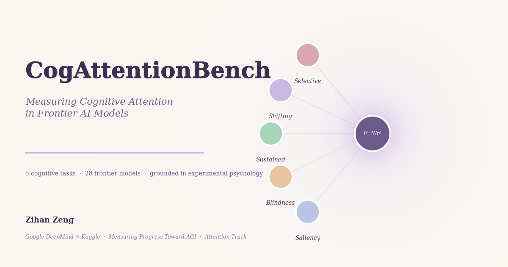

# CogAttentionBench

**Probing Cognitive Attention in Frontier AI Models**

[](https://doi.org/10.5281/zenodo.19633174)
[](https://opensource.org/licenses/MIT)
[](croissant_metadata.json)
[](https://neurips.cc/Conferences/2026/CallForDatasetsBenchmarks)



## Overview

CogAttentionBench measures whether AI models exhibit the cognitive attention patterns studied in experimental psychology. Unlike existing benchmarks that test knowledge retrieval, CogAttentionBench tests **attention allocation** — the ability to filter, sustain, shift, and prioritize information under interference.

> Current attention tests (e.g., needle-in-a-haystack) use explicit markers that LLMs trivially parse. CogAttentionBench creates **real interference** — competing signals where the correct response requires suppressing stronger but incorrect signals.

**Submission:** NeurIPS 2026 Datasets & Benchmarks Track
**Originally Built For:** Google DeepMind × Kaggle: Measuring Progress Toward AGI (Attention track)
**Author:** [Cora Zeng](https://github.com/xqscora) (Lumen-Nox)
**Theoretical Foundation:** [Magnetic Field of Attention (MFA)](https://doi.org/10.5281/zenodo.18979607) framework (Zeng, 2026)
**Archived Dataset:** [10.5281/zenodo.19633174](https://doi.org/10.5281/zenodo.19633174)

## Five Tasks

| # | Task | Paradigm | What It Tests |
|---|------|----------|---------------|
| 1 | **Selective Attention** | Stroop (1935); Eriksen Flanker (1974) | Extracting targets when statistically stronger distractors compete |
| 2 | **Attention Shifting** | Rogers & Monsell (1995) | Switching between confusable rules with irregular patterns |
| 3 | **Sustained Attention** | CPT (Rosvold et al., 1956) | Finding unmarked targets buried in increasing filler context |
| 4 | **Inattentional Blindness** | Simons & Chabris (1999) | Noticing anomalies during a primary task, then recalling them |
| 5 | **Saliency Awareness** | Treisman & Gelade (1980); Itti & Koch (2001) | Ranking competing salient elements by perceptual hierarchy |

## Key Design Principles

- **LLM-specific interference**: Frequency traps, context priming, expectation violation — exploiting how language models process information
- **No explicit markers**: Targets embedded naturally in flowing text, not flagged with `[TASK]` tags
- **Grounded in psychology**: Each task maps to established experimental paradigms with known human baselines
- **Differential predictions**: Where AI attention diverges from human attention reveals what "attention" means in each system

## Results (28 Models Evaluated)

| Model | Selective | Shifting | Sustained | Inattentional | Saliency | **Overall** |
|-------|-----------|----------|-----------|---------------|----------|-------------|
| GPT-5.4 | 1.00 | 1.00 | 1.00 | 1.00 | 0.86 | **0.97** |
| Claude Sonnet 4.6 | 1.00 | 1.00 | 1.00 | 1.00 | 0.72 | **0.94** |
| Gemma 3 4B | 1.00 | 0.75 | 1.00 | 1.00 | 0.63 | **0.88** |
| DeepSeek V3.1 | 0.00 | 1.00 | 1.00 | 1.00 | 0.71 | **0.74** |
| Gemma 3 1B | 0.00 | 0.13 | 0.00 | 0.00 | 0.00 | **0.06** |

*22 of 28 models score 1.00 overall — saliency awareness is the key discriminator for frontier models.*

### Key Findings

1. **Saliency awareness is the hardest dimension.** Even GPT-5.4 scores only 0.86 — perceptual hierarchy reasoning remains challenging.
2. **Attention shifting scales with model size.** Gemma 3 4B scores 0.75 vs 1B's 0.13 — cognitive flexibility requires capacity.
3. **DeepSeek V3.1 shows selective attention deficit.** 0.00 on selective despite strong others — pattern reminiscent of Stroop interference in humans.
4. **Inattentional blindness reveals a frontier boundary.** All frontier models: 1.00; Gemma 1B: 0.00.

## NeurIPS 2026 Datasets & Benchmarks Track

This benchmark is being submitted to NeurIPS 2026 D&B Track. The following artifacts are provided for review and reproducibility:

- [`NEURIPS_PAPER.md`](NEURIPS_PAPER.md) — full paper draft (markdown source)
- [`croissant_metadata.json`](croissant_metadata.json) — Croissant 1.0 dataset metadata (NeurIPS D&B requirement)
- [Zenodo archive `10.5281/zenodo.19633174`](https://doi.org/10.5281/zenodo.19633174) — permanent DOI with all dataset files, paper PDF, and LaTeX source
- All 5 task notebooks (`task1_*.ipynb` … `task5_*.ipynb`) are runnable on Kaggle benchmarks SDK

## Project Structure

```
├── README.md
├── NEURIPS_PAPER.md                        # NeurIPS 2026 D&B submission (source)
├── croissant_metadata.json                 # Croissant 1.0 metadata (NeurIPS requirement)
├── WRITEUP.md                              # Competition writeup (≤1500 words)
├── benchmark_description.md                # Kaggle benchmark description
├── HARDENED_TASKS_SUMMARY.md               # v2 hardening strategies
├── kaggle_notebook.py                      # All tasks in one file (v1)
├── kaggle_notebook_v2.py                   # All tasks in one file (v2, harder)
├── task1_selective_attention_v6.ipynb       # Kaggle notebook — Selective Attention
├── task2_attention_shifting_v5.ipynb        # Kaggle notebook — Attention Shifting
├── task3_sustained_attention_v6.ipynb       # Kaggle notebook — Sustained Attention
├── task4_inattentional_blindness_v5.ipynb   # Kaggle notebook — Inattentional Blindness
├── task5_saliency_awareness_v3.ipynb        # Kaggle notebook — Saliency Awareness
├── src/                                    # Task implementations (Python)
├── dataset_selective_attention.json         # Dataset: selective attention items
├── dataset_sustained_attention.json         # Dataset: sustained attention items
├── dataset_*.py                            # Dataset generation scripts
└── cogattentionbench_cover.png             # Cover image
```

## Difficulty Design (v2 Hardening)

Each task has items progressing through five difficulty tiers:

| Tier | Items | Strategy |
|------|-------|----------|
| Medium | 1-2 | Baseline — solvable by frontier models |
| Hard | 3-5 | Strong attention mechanisms required |
| Very Hard | 6-10 | Multiple strategies combined |
| Extreme | 11-15 | Maximum single-strategy difficulty |
| Ultimate | 16-20 | All strategies at maximum intensity |

Key hardening strategies:
- **Adversarial statistical priming** (7x–20x repetition of wrong answers) — the only thing that tripped GPT-5.4
- **Ultra-long context burial** (10k+ token distractors)
- **Multi-step reasoning with information conflict**
- **Enhanced Stroop effects** across multiple dimensions

## Connection to MFA Theory

This benchmark operationalizes predictions from the **Magnetic Field of Attention (MFA)** framework (Zeng, 2026), which models attentional processes as field-theoretic gradients following F = S/r², unifying five classical attention theories (Spotlight, Gradient, Load, Resource, Spreading Activation) as special cases of a single magnetic field equation.

MFA preprint: [10.5281/zenodo.18979607](https://doi.org/10.5281/zenodo.18979607)

## Built With

- [kaggle-benchmarks SDK](https://github.com/Kaggle/kaggle-benchmarks) (`kbench`)
- Python 3.10+
- Jupyter Notebooks

## Citation

```bibtex
@inproceedings{zeng2026cogattentionbench,
  author    = {Zeng, Zihan},
  title     = {CogAttentionBench: Probing Cognitive Attention Mechanisms in Frontier AI Models},
  booktitle = {Advances in Neural Information Processing Systems (NeurIPS),
               Datasets and Benchmarks Track},
  year      = {2026},
  doi       = {10.5281/zenodo.19633174},
  url       = {https://github.com/Lumen-Nox/CogAttentionBench}
}
```

## References

- Zeng, Z. (2026). *Attention as a Magnetic Field: A Unifying Framework.* Zenodo. [10.5281/zenodo.18979607](https://doi.org/10.5281/zenodo.18979607)
- Stroop, J. R. (1935). Studies of interference in serial verbal reactions. *J. Exp. Psychol.*, 18(6), 643–662.
- Eriksen, B. A., & Eriksen, C. W. (1974). Effects of noise letters upon identification. *Perception & Psychophysics*, 16, 143–149.
- Rogers, R. D., & Monsell, S. (1995). Costs of a predictable switch. *J. Exp. Psychol.: General*, 124(2), 207–231.
- Rosvold, H. E., et al. (1956). A continuous performance test. *J. Consulting Psychol.*, 20(5), 343–350.
- Simons, D. J., & Chabris, C. F. (1999). Gorillas in our midst. *Perception*, 28(9), 1059–1074.
- Treisman, A. M., & Gelade, G. (1980). Feature-integration theory. *Cognitive Psychol.*, 12(1), 97–136.
- Itti, L., & Koch, C. (2001). Computational modelling of visual attention. *Nature Rev. Neurosci.*, 2(3), 194–203.

## License

MIT License — see [LICENSE](LICENSE) for details.
